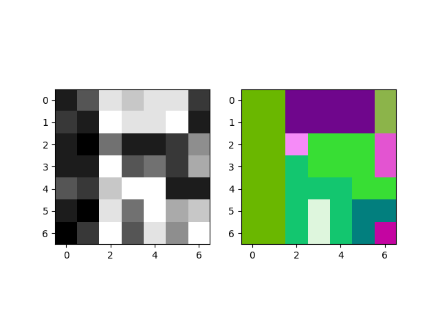
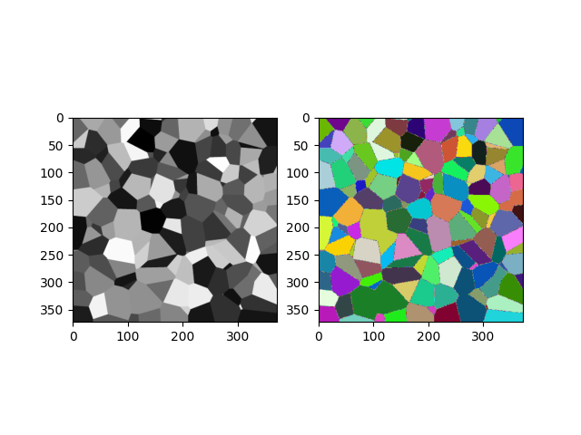
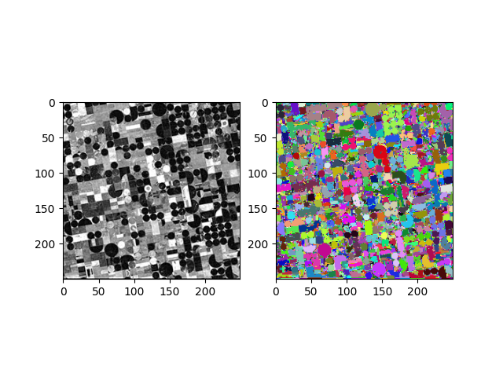

# Alpha-Omega Connected Components of an image [[1]](#1)

## Libraries

- numpy
- matplotlib
- queue

## Definition
Two pixels p and q in an image are (α,ω)-related if there exists a path of neighborhood 4 between those pixels  and all pairs of consecutive pixels of this path have a range <= α. Furthermore, all the pixels of the path must have a value <= ω.    
A single pixel is (α,ω)-related to itself.    
The **(α,ω)-connected component** of a pixel p is the largest αi connected component of p such that αi <= α and the range of this connected component is <= ω.    

## Files
* `alphatree.py`, main function and (α,ω)-connected component labelling algorithm
* `helpers.py`, auxilary functions
* `images.py`, test image from figure 2 of the paper [[1]](#1)

## Results

* Figure 2 of the paper :

  

* circles.png :

  

* Coloured_Voronoi_3D_slice.png :   

  

* road.jpg :  

  

* field2.jpg :    

  

## References
<a id="1">[1]</a> 
Pierre Soil, **Constrained Connectivity for Hierarchical Image Partitioning and Simplification**, 2008