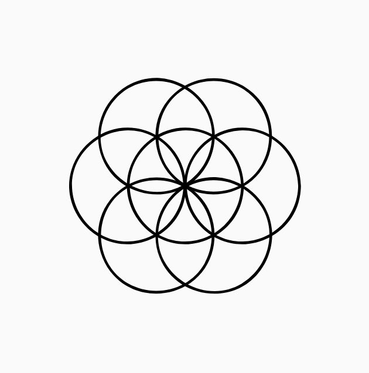
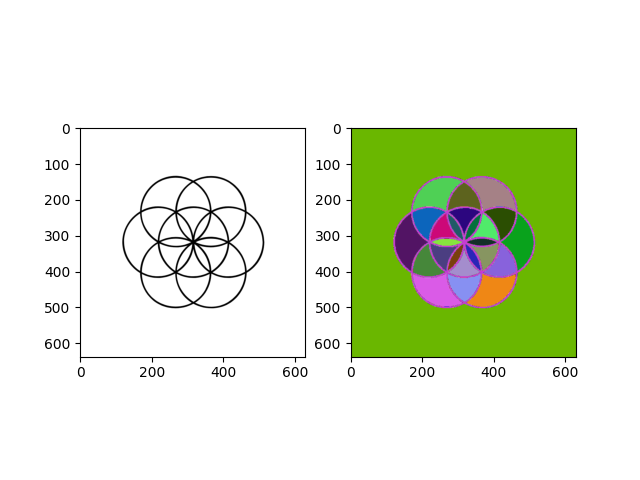
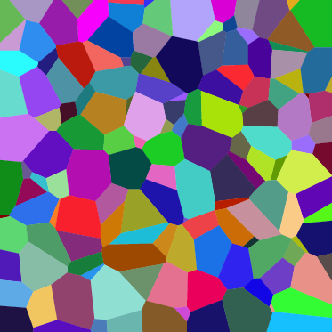
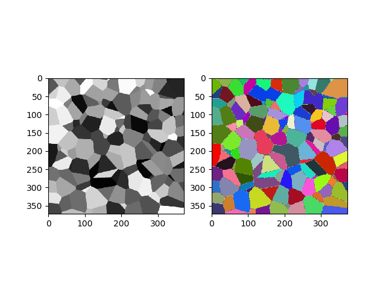
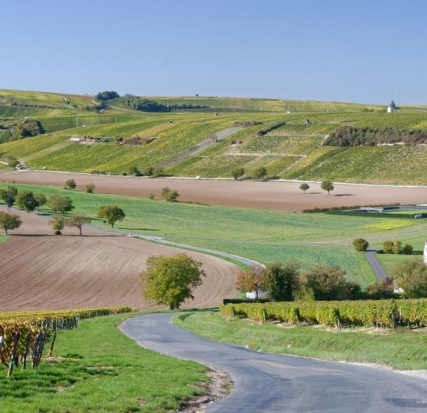
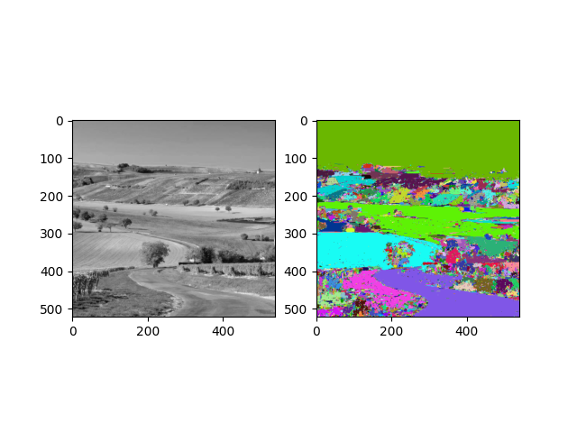
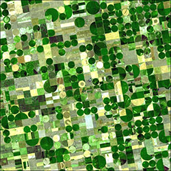
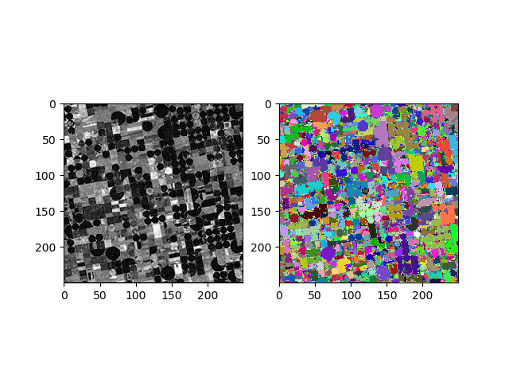

# Alpha-Omega Tree [[1]](#1)

**Libraries:**

- numpy
- matplotlib
- queue

**Files**
* `alphatree.py`, main function and (α,ω)-connected component labelling algorithm
* `helpers.py`, auxilary functions
* `images.py`, test image from figure 2 of the paper [[1]](#1)

**Results**

* circles.png    

  
  

* Coloured_Voronoi_3D_slice.png   

  
  

* road.jpg    

  
  

* field2.jpg    

  
  

## References
<a id="1">[1]</a> 
Pierre Soil, **Constrained Connectivity for Hierarchical Image Partitioning and Simplification**, 2008