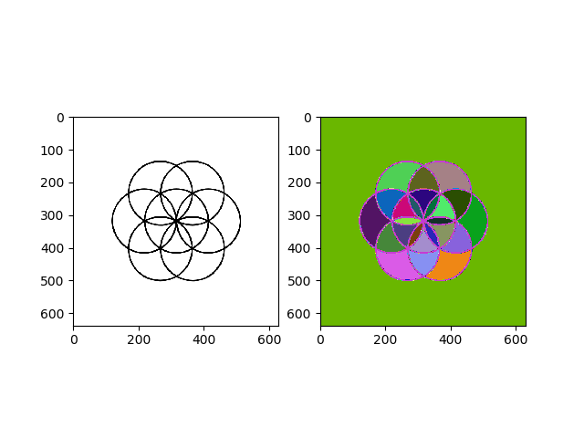
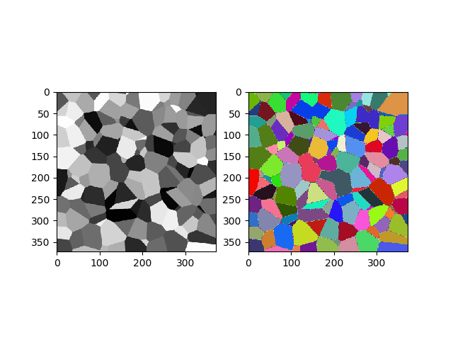
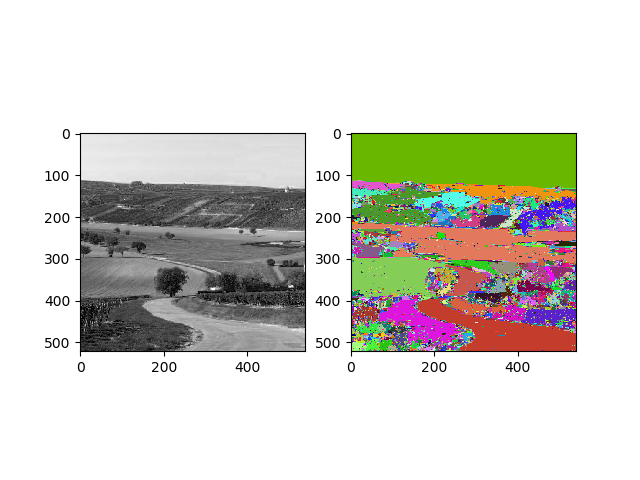
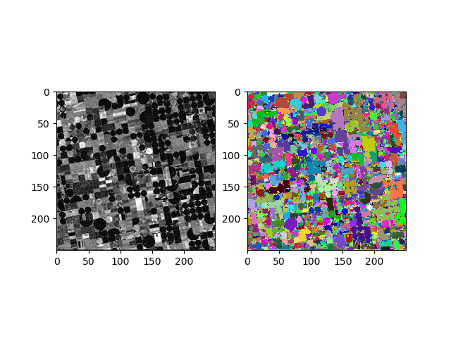

# tigd-alpha-tree

**Bibliothèques:**

- numpy
- matplotlib
- queue

**Fichiers**
* `alphatree.py`, fonction main et algorithme ($\alpha$,$\omega$)-connected component labeling
* `helpers.py`, fonctions auxiliaires
* `images.py`, image de test de la figures 2 du papier

**Resultats**

* circles.png

* Coloured_Voronoi_3D_slice.png

* road.jpg

* field2.jpg
